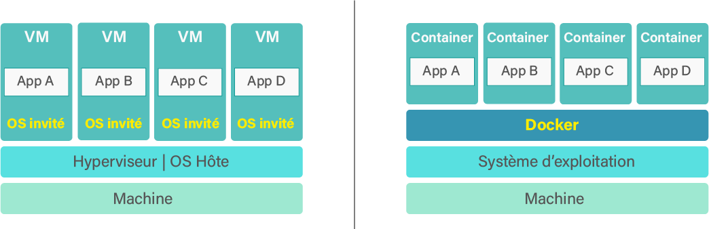

# Docker

Docker est un outil open-source écrit en langage **Go** qui permet de créer, déployer et lancer des applications en utilisant des <mark style="color:yellow;">**Container**</mark>.

Pour mettre en place ces **Container**, on crée des <mark style="color:yellow;">**Docker**</mark> <mark style="color:yellow;">**Image**</mark>. <mark style="color:blue;">L’</mark><mark style="color:blue;">**Image**</mark> <mark style="color:blue;"></mark><mark style="color:blue;">permet de configurer tout l’environnement dans lequel le conteneur va s'exécuter</mark>. Pour créer ces **Images**, Docker utilise un fichier spécial appelé <mark style="color:yellow;">**Dockerfile**</mark>, qui grâce à une syntaxe simple va permettre de préparer les images.

L’image est ensuite construite par le <mark style="color:yellow;">**Docker Daemon**</mark> via l’utilisation de commandes dans le terminal qui sont regroupées dans ce qu’on appelle un **CLI**.

Pour gérer l’ensemble des conteneurs d’une application, on utilise <mark style="color:yellow;">**Docker Compose**</mark>.

**Docker Compose** permet de gérer tous les conteneurs via des services et de faciliter grandement leur configuration.

Pour les grosses applications, il est également possible de les déployer sur plusieurs serveurs pour augmenter les performances et pouvoir faire face à plus de requêtes. Pour cela, on utilise <mark style="color:yellow;">**Docker Swarm**</mark> qui va automatiser le déploiement des conteneurs sur tout notre <mark style="color:yellow;">**Cluster.**</mark>

## Pourquoi utiliser Docker ?

Docker permet de manipuler une application ainsi que tout son environnement. On peut notamment <mark style="color:blue;">push sur Github ou sur un serveur, l'application et son Image</mark> afin d'être certain quelle soit fonctionnelle (pas de dépendances deprecated ou de composants manquants). Par conséquent, si on a plusieurs applications en ligne sur un serveur et qu'un problème survient au sein de l'environnement de l'une d'entre elles, les autres applications pourront tourner sans problème.

Il est également possible de déployer plusieurs versions d'une même application avec à chaque fois son environnement ; de ce fait, si il y a un incident sur une des versions, une autre peut prendre le relais. Cette mécanique  accorde la possibilité d'avoir un grand nombre de requêtes sur une application sans surcharger le serveur.

Docker permet une utilisation plus efficiente des ressources d'un système tout en permettant les mêmes avantages qu'une machine virtuelle : c'est-à-dire principalement l'isolation et la reproductibilité.

Les applications conteneurisées utilisent beaucoup moins de ressources que des machines virtuelles car elles utilisent le même **noyau Linux**.

## Architecture

<figure><figcaption>
Modèle d'architecture d'un système de VM classique et de Docker
</figcaption></figure>

| Système VM classique                                                                                                                    | Docker                                                                                                                                                                                                                                                                                                                     |
| --------------------------------------------------------------------------------------------------------------------------------------- | -------------------------------------------------------------------------------------------------------------------------------------------------------------------------------------------------------------------------------------------------------------------------------------------------------------------------- |
| Des VM indépendantes qui embarquent toutes leur propre système d'exploitation complet et sont gérées par un Hyperviseur (type Proxmox). | Des Containers (processus isolés les uns des autres par des technos du noyau Linux comme les Cgroupes et les NameSpaces). Chaque processus peut accéder à l'ensemble de la machine hôte et n'a donc pas besoin d'un OS dédié mais seulement de ce qui manque à la machine hôte pour faire tourner l'application embarquée. |

